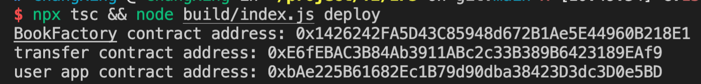
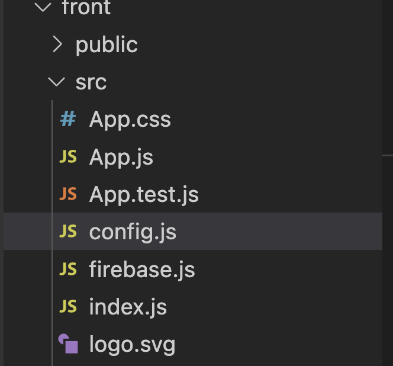
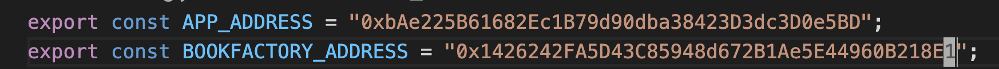

# IP5: Book Licensing and Publishing on the Blockchain

This Project demonstrates the basic foundations of a blockchain application that facilitates
the trading of book licenses. Within this repository are smart contract files which, when
included in an ethereum based blockchain, can be interacted with using either the Remix and
solidity online IDE or by using the developed frontend application developed by our team.

The front end was developed using React and connects directly to the Reverse Oracle contract "userapp.sol"
in order to send and recieve data from the blockchain. Alongside the Cloud Firebase database, this application
demonstrates the typical usage of the contracts without the need for a fully fledged application.

Below are relevant instructions to use the application.

### NOTE: Because this application uses a cloud database, errors may occur if attempting to use several different instances of the same Oracle contract.

#### This is because the data on the database does not automatically clear when a new contract is created.

### If there needs to be more than one contract made, please contact someone from the team so the database can be cleared.

----


### Requirements / Installations

First of all a few things are required.

1. Remix needs to be used to deploy relevant contracts which may require the "remixd" application installed on the local machine too.
2. A Ganache test chain is needed, in particular it needs to be hosted on the local host on port 8545. (All contracts should be deployed to this chain)
3. Using npm or otherwise, install all of the requirements in the package.json file located in the "front" folder. If for some reason this doesnt work, the dependencies are below:
   "dependencies": {
   "bootstrap": "^4.3.1",
   "firebase": "^9.9.1",
   "react": "^18.1.0",
   "react-bootstrap": "^1.0.0-beta.5",
   "react-dom": "^18.1.0",
   "react-scripts": "2.1.5",
   "web3": "^1.0.0-beta.46"
   }

### Setting Up

1. Granted the above requirements are fulfilled, simply launch the ganache test chain and make sure to use one of the given accounts on the chain by default.

2. Copy the private key from ganache to `eth_accounts/accounts.json`

3. Once this is done, run 

   ```sh
   npx tsc && node build/index.js deploy
   ```

   it will deploy the contracts

   

4. This allows for the oracle to be deployed with the addresses of the transfer and bookFactory. Keep note of this address too.

5. From here return to the ./front folder and then go to ./front/src/config.js

   

6. Modify the corresponding environment variables for the BookFactory and userApp addresses.

   

   

### Run

Simply use `npm start` from the ./front folder to start the frontend. Which should automatically connect to the testchain ready to be run.
